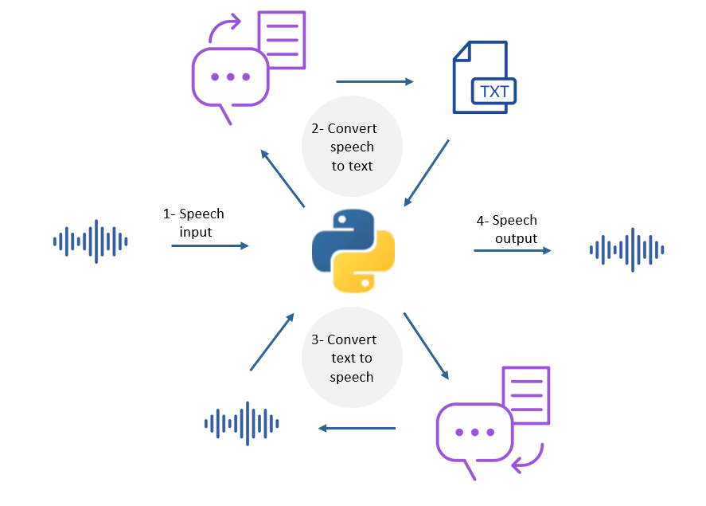

# Transcribe

<!-- PROJECT IMAGE -->
<p align="center">

</p>

<!-- TABLE OF CONTENTS -->
## Table of Contents

* [Abstract](#abstract)
* [Installation](#installation)
* [Quick Start](#quick-start)
* [Implementation](#implementation)

<!-- ABSTRACT -->
## Abstract

The idea behind this repository is to convert the speech-to-text by [Watson Speech to Text](https://www.ibm.com/cloud/watson-speech-to-text) and then save it in [`output.txt`](https://github.com/MohammedAlosaimi/watson-streaming-stt/blob/master/watson-streaming-stt/output.txt). Moreover, it converts the file [`output.txt`](https://github.com/MohammedAlosaimi/watson-streaming-stt/blob/master/watson-streaming-stt/output.txt) from text to speech by [Watson Text to Speech](https://www.ibm.com/cloud/watson-text-to-speech) and then saves it in [`output.mp3`](https://github.com/MohammedAlosaimi/watson-streaming-stt/blob/master/watson-streaming-stt/output.mp3).

<!-- INSTALLATION -->
## Installation

To install, use `pip`: 

```bash
pip install -r requirements.txt
```
if errors on windows installing `pyaudio`
Install `pipwin`: 

```bash
pip install pipwin
```

Then go install `pyaudio`: 

```bash
pipwin install pyaudio
```

<!-- QUICK START -->
## Quick Start

All you need to run this program is to Install the requirements and then you can run the program from [`transcribe`](https://github.com/MohammedAlosaimi/watson-streaming-stt/blob/master/watson-streaming-stt/transcribe.py). Note: You may need to change the `apikey` and `url` if you want to run it from your own server. Text-to-Speech from [`textospeech.py`](https://github.com/MohammedAlosaimi/watson-streaming-stt/blob/master/watson-streaming-stt/textospeech.py) and Speech-to-Text from [`speech.cfg`](https://github.com/MohammedAlosaimi/watson-streaming-stt/blob/master/watson-streaming-stt/speech.cfg).

<!-- IMPLEMENTATION -->
## Implementation

The following code was added in [`transcribe`](https://github.com/MohammedAlosaimi/watson-streaming-stt/blob/master/watson-streaming-stt/transcribe.py) to saving the text in a txt file and then called `storeMP3File()` function from [`textospeech.py`](https://github.com/MohammedAlosaimi/watson-streaming-stt/blob/master/watson-streaming-stt/textospeech.py) in order to convert the text to speech and save the result in an mp3 file. After that the `system` will play the mp3 file

```python
def textToSpeech():
    # Add this function, so it can save the results in txt file
    with open('output.txt', 'w') as output:
        output.writelines(textResult)
    
    # Convert the text to speech and then store it in mp3 file
    textospeech.storeMP3File()
    
    os.system('output.mp3')
```

The following code is in [`textospeech.py`](https://github.com/MohammedAlosaimi/watson-streaming-stt/blob/master/watson-streaming-stt/textospeech.py). It is used to open a txt file to convert it to speech by Watson Text to Speech and then save it as an mp3 file.

```python
def storeMP3File():
    # open the txt file and take the results
    with open('output.txt', 'r') as out:
        text = out.readlines()

    # combine the multi lines in one line
    text = [line.replace('\n', '') for line in text]
    text = ''.join(str(line) for line in text)

    # convert the text to speech and then store it as mp3 file
    with open('output.mp3', 'wb') as audio_file:
        res = tts.synthesize(text, accept='audio/mp3', voice='en-US_AllisonV3Voice').get_result()
        audio_file.write(res.content)
```
